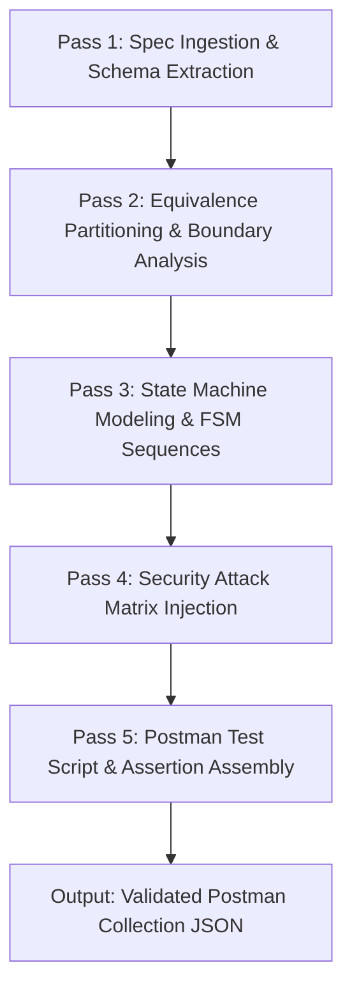
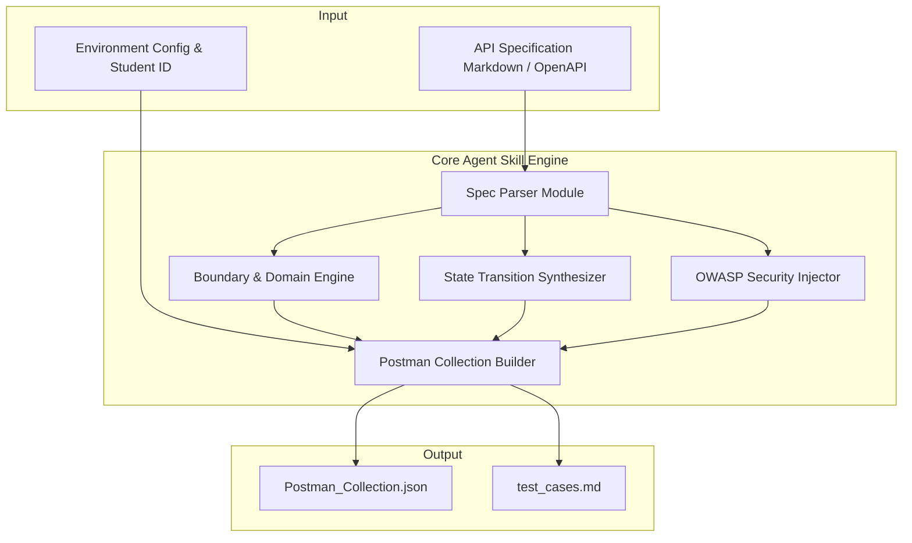

# AI-Driven API Test Generator Agent Skill

## 1. Overview & Capability
Kỹ năng (Agent Skill) `api-test-generator` được thiết kế để tự động hóa quy trình phân tích đặc tả API (`api_specification.md` hoặc OpenAPI/Swagger), mô hình hóa miền giá trị, máy trạng thái (FSM) và ma trận bảo mật OWASP API Security để tự động sinh ra bộ ca kiểm thử Postman hoàn chỉnh có assertions tự động.

---

## 2. Multi-Pass Generation Workflow

Quy trình sinh ca kiểm thử được thực hiện qua **5 Passes chuyên biệt**:



1. **Pass 1 - Trích xuất Đặc tả (Spec Ingestion):**
   - Đọc cấu trúc endpoint, HTTP method, URL path parameters, query parameters, header requirements và request body schema.
   - Nhận diện các ràng buộc kiểu dữ liệu (data types, required fields, constraints).

2. **Pass 2 - Phân tích Phân vùng Tương đương & Giá trị Biên (EP & BVA):**
   - Chia mỗi tham số thành các phân vùng: Hợp lệ (Valid), Không hợp lệ (Invalid), Biên dưới (Min), Biên trên (Max), Giá trị đặc biệt (Null, Empty, Whitespace, Unicode).

3. **Pass 3 - Mô hình hóa Máy Trạng thái (FSM State Transitions):**
   - Phân tích vòng đời đối tượng (Lifecycle: Create -> Read -> Update -> Delete).
   - Thiết lập chuỗi request liên hoàn và các bước chuyển trạng thái hợp lệ/bất hợp lệ.

4. **Pass 4 - Ma trận Tấn công Bảo mật (Security Injection Matrix):**
   - Tự động chèn các vector tấn công: BFLA (Broken Function Level Authorization), BOLA/IDOR, SQL Injection, Stored XSS, Price Tampering, Parameter Injection.

5. **Pass 5 - Lắp ráp Script Kiểm thử Postman (Postman Test Script Assembly):**
   - Sinh cấu trúc Postman Collection JSON v2.1.0 chuẩn hóa kèm test scripts Javascript (`pm.test`, `pm.response.to.have.status`, `pm.expect`).

---

## 3. Architecture & Components



---

## 4. Pseudocode (Mã Giả Thuật Toán Sinh Tự Động)

```text
ALGORITHM GenerateApiTestSuite(specDocument, envConfig)
    INPUT:
        specDocument: Văn bản đặc tả API (Markdown hoặc OpenAPI)
        envConfig: Cấu hình môi trường { baseUrl, studentId, tokens }
    OUTPUT:
        postmanCollection: Đối tượng JSON Postman Collection v2.1.0
        testCasesMarkdown: Bảng tổng hợp ca kiểm thử Markdown

    BEGIN
        // BƯỚC 1: TRÍCH XUẤT ĐẶC TẢ
        endpointsList := ParseApiEndpoints(specDocument)
        allTestItems := EmptyList()

        // BƯỚC 2: DUYỆT TỪNG ENDPOINT ĐỂ SINH TEST CASES
        FOR EACH endpoint IN endpointsList DO
            endpointTests := EmptyList()

            // 2.1 Domain & Boundary Tests
            FOR EACH param IN endpoint.parameters DO
                validPartitions := GetValidPartitions(param)
                invalidPartitions := GetInvalidPartitions(param)
                boundaryValues := CalculateBoundaries(param)

                FOR EACH val IN (validPartitions + invalidPartitions + boundaryValues) DO
                    testCase := CreateDomainTestCase(endpoint, param, val)
                    endpointTests.Append(testCase)
                END FOR
            END FOR

            // 2.2 State Transition Tests
            IF endpoint.hasLifecycle OR endpoint.isStateMachine THEN
                lifecycleSequences := SynthesizeFsmSequences(endpoint)
                endpointTests.AppendAll(lifecycleSequences)
            END IF

            // 2.3 Security Tests (OWASP API Top 10)
            secPayloads := LoadSecurityPayloads([
                "SQL_INJECTION",
                "STORED_XSS",
                "BFLA_ACCESS_CONTROL",
                "BOLA_IDOR",
                "PRICE_TAMPERING"
            ])
            FOR EACH secVector IN secPayloads DO
                secTestCase := CreateSecurityTestCase(endpoint, secVector)
                endpointTests.Append(secTestCase)
            END FOR

            // 2.4 Schema Validation Test
            schemaTest := CreateSchemaValidationTestCase(endpoint.responseSchema)
            endpointTests.Append(schemaTest)

            allTestItems.Append(GroupIntoSubfolders(endpoint, endpointTests))
        END FOR

        // BƯỚC 3: LẮP RÁP POSTMAN COLLECTION
        postmanCollection := InitializePostmanCollection(envConfig.studentId)
        postmanCollection.InjectPreRequestScript("X-Student-Id: " + envConfig.studentId)
        postmanCollection.AddFolders(allTestItems)

        // BƯỚC 4: KẾT XUẤT KẾT QUẢ
        ExportJsonFile("collections/Postman_Collection.json", postmanCollection)
        testCasesMarkdown := FormatMarkdownReport(allTestItems)
        ExportMarkdownFile("test_cases.md", testCasesMarkdown)

        RETURN postmanCollection
    END
```

---

## 5. Usage & Execution
Chạy generator script tự động:
```bash
node .agents/skills/api-test-generator/scripts/generator.js --spec eshop-sut/api_specification.md --out collections/Generated_Collection.json
```
