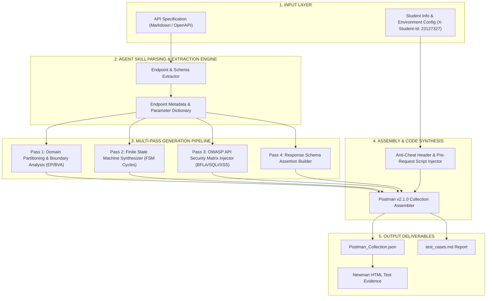
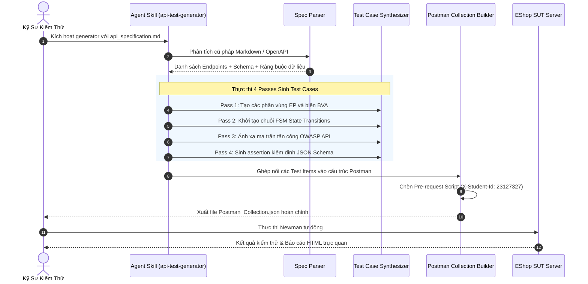

# Thiết Kế Agent Skill Tự Động Sinh Test Cases (AI-Driven API Test Generator)

- **Mã số sinh viên:** `23127327`
- **Họ và tên sinh viên:** `Lưu Ngô Quốc Bảo`
- **Cấp độ năng lực Bloom-AI:** **G9.5 (Create)** — Thiết kế và hiện thực hóa một Agent Skill hoàn chỉnh có khả năng tự động hóa quy trình kỹ sư kiểm thử.
- **Tên Agent Skill:** `api-test-generator`
- **Mã nguồn Agent Skill:** [`.agents/skills/api-test-generator/`](../.agents/skills/api-test-generator/)

---

## 1. Đặt Vấn Đề & Mục Tiêu Thiết Kế (Motivation & Objectives)

Trong quy trình phát triển phần mềm hiện đại, việc viết API Test Cases thủ công tốn rất nhiều thời gian và dễ bỏ sót các trường hợp biên, các lỗ hổng phân quyền (BFLA/BOLA) hay các trạng thái tương tác phức tạp. 

Mặt khác, nếu chỉ đưa prompt đơn lẻ cho AI ("Hãy sinh test case cho API này"), AI thường mắc phải các điểm yếu:
- Chỉ sinh các ca kiểm thử tích cực (Happy path) bề nổi.
- Bỏ sót các quy tắc nghiệp vụ liên kết (Price Tampering, làm rỗng giỏ hàng sau thanh toán).
- Thiếu các ca kiểm thử về toàn vẹn dữ liệu quan hệ và kiểm thử bảo mật chuyên sâu (SEC-01 $\rightarrow$ SEC-07).
- Không tự động chèn header định danh chống gian lận (`X-Student-Id`).

**Mục tiêu của Agent Skill `api-test-generator`:** Xây dựng một cỗ máy sinh test tự động đa tầng (Multi-Pass Engine) nhận đầu vào là đặc tả API dạng Markdown/OpenAPI và tự động xuất ra bộ sưu tập Postman Collection v2.1.0 hoàn chỉnh, sẵn sàng chạy ngay trên Newman và CI/CD.

---

## 2. Sơ Đồ Kiến Trúc Hệ Thống (Self-Drawn Architecture Diagram)

Sơ đồ kiến trúc dưới đây được thiết kế và xây dựng theo mô hình Module hóa 5 tầng (5-Layer Modular Architecture):



---

## 3. Quy Trình Xử Lý 5 Passes Chi Tiết (Pipeline Breakdown)



1. **Pass 1: Phân vùng Tương đương & Phân tích Biên (EP & BVA):**
   - Tự động nhận diện kiểu dữ liệu của từng trường (`string`, `number`, `boolean`, `array`, `object`).
   - Tạo các phân vùng: Hợp lệ (Valid), Biên dưới (Min), Biên trên (Max), Giá trị ngoại lệ (Empty `""`, Whitespace `"   "`, `null`, sai kiểu).
2. **Pass 2: Mô hình hóa Máy Trạng thái (FSM State Transitions):**
   - Nhận diện các endpoint có tính chu kỳ dữ liệu (CRUD Lifecycle hoặc Order State Machine).
   - Tự động sinh chuỗi request liên hoàn lưu biến môi trường (ví dụ: `POST /api/categories` lưu `tempId` $\rightarrow$ `GET` xác minh $\rightarrow$ `PUT` đổi tên $\rightarrow$ `DELETE` xóa $\rightarrow$ `GET` xác minh đã xóa).
3. **Pass 3: Ma trận Tấn công An ninh OWASP (OWASP Security Matrix):**
   - Tự động sinh test kiểm tra Broken Function Level Authorization (BFLA): Gọi endpoint Admin bằng `userToken` thường để kiểm tra xem có chặn `403 Forbidden` hay không.
   - Chèn các vector SQL Injection (`' OR '1'='1`) và Stored XSS Script (`<script>alert(1)</script>`).
   - Chèn vector tấn công gian lận giá (Price Tampering: gửi `total_amount = 0` khi giỏ hàng có giá trị cao).
4. **Pass 4: Kiểm tra Cấu trúc Phản hồi (Schema Validation):**
   - Sinh script Javascript xác thực các thuộc tính bắt buộc, kiểm tra kiểu dữ liệu trong response body và đảm bảo không lộ thông tin nhạy cảm (như mật khẩu theo SEC-01).
5. **Pass 5: Lắp ráp Bộ Sưu Tập Postman (Collection Assembly):**
   - Tự động gắn Pre-request Script toàn cục để nạp header `X-Student-Id: 23127327` cho 100% request.
   - Đóng gói theo chuẩn Postman Collection Schema v2.1.0.

---

## 4. Mã Giả Thuật Toán (Structured Algorithmic Pseudocode)

```text
ALGORITHM RunApiTestGeneratorSkill
    INPUT:
        specFilePath: Đường dẫn tệp đặc tả (VD: 'eshop-sut/api_specification.md')
        studentId: Chuỗi mã số sinh viên ('23127327')
        outputCollectionPath: Đường dẫn xuất tệp Postman JSON
    OUTPUT:
        Tệp Postman_Collection.json chuẩn hóa chứa đầy đủ test scripts

    BEGIN
        PRINT "[INIT] Khởi động Agent Skill api-test-generator..."
        specContent := ReadFile(specFilePath)
        endpointDefinitions := ParseSpecification(specContent)

        postmanCollection := CreateEmptyPostmanCollection(
            name = "EShop Automated Test Suite - " + studentId,
            version = "2.1.0"
        )

        // Bổ sung Pre-request script định danh chống gian lận
        postmanCollection.AddGlobalPreRequestScript(
            "pm.request.headers.upsert({ key: 'X-Student-Id', value: '" + studentId + "' });"
        )

        FOR EACH endpoint IN endpointDefinitions DO
            folder := CreateFolder(endpoint.name)

            // Pass 1: Domain & Boundary
            domainTests := GenerateBoundaryAndDomainTests(endpoint)
            folder.AddItems(domainTests)

            // Pass 2: FSM & Lifecycle
            IF endpoint.requiresStatePersistence THEN
                lifecycleTests := SynthesizeLifecycleSequence(endpoint)
                folder.AddItems(lifecycleTests)
            END IF

            // Pass 3: OWASP Security Attacks
            securityTests := InjectSecurityAttackVectors(endpoint, [
                "BFLA_ADMIN_BYPASS",
                "PRICE_TAMPERING",
                "SQL_INJECTION",
                "STORED_XSS",
                "UNAUTHENTICATED_ACCESS"
            ])
            folder.AddItems(securityTests)

            // Pass 4: Schema Assertions
            schemaTests := BuildResponseSchemaValidation(endpoint)
            folder.AddItems(schemaTests)

            postmanCollection.AddFolder(folder)
        END FOR

        WriteJsonToFile(outputCollectionPath, postmanCollection)
        PRINT "[SUCCESS] Xuất thành công bộ kiểm thử Postman tại: " + outputCollectionPath
    END
```

---

## 5. Hướng Dẫn Thực Thi Demo & Video Minh Họa

- **Lệnh chạy CLI trực tiếp:**
  ```bash
  node .agents/skills/api-test-generator/scripts/generator.js --spec eshop-sut/api_specification.md --student-id 23127327 --out collections/Generated_Collection.json
  ```
- **Kịch bản ghi hình Demo (YouTube Walkthrough):**
  1. Giới thiệu cấu trúc Agent Skill trong thư mục `.agents/skills/api-test-generator/`.
  2. Giải thích sơ đồ kiến trúc 5 tầng và mã giả thuật toán.
  3. Mở terminal, chạy lệnh sinh tự động `generator.js`.
  4. Mở tệp kết quả `collections/Generated_Collection.json` để kiểm tra các test cases và header `X-Student-Id`.
  5. Chạy Newman trên file vừa sinh để chứng minh các ca kiểm thử hoạt động chính xác và phát hiện lỗi thực tế trên hệ thống SUT.
