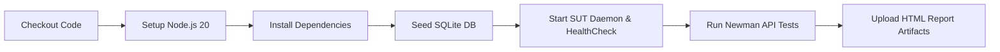

# Báo Cáo Tích Hợp CI/CD Pipeline Cho Hệ Thống Kiểm Thử API (CI/CD Report)

- **Sinh viên thực hiện:** Lưu Ngô Quốc Bảo (MSSV: `23127327`)
- **Dự án:** Kiểm thử tự động EShop API với Postman & Newman trên GitHub Actions
- **Tệp cấu hình:** [`.github/workflows/api-testing.yml`](../.github/workflows/api-testing.yml)

---

## 1. Kiến Trúc Pipeline CI/CD (GitHub Actions Workflow Architecture)

Pipeline được xây dựng hoàn toàn tự động trên nền tảng GitHub Actions với các đặc tính kỹ thuật:
- **Hệ điều hành runner:** `ubuntu-latest`
- **Môi trường thực thi:** Node.js v20 LTS
- **Cơ chế kích hoạt (Triggers):**
  - Tự động kích hoạt khi có `push` lên nhánh `main`.
  - Tự động kích hoạt khi có `pull_request` tạo vào `main`.
  - Hỗ trợ kích hoạt thủ công qua giao diện GitHub (`workflow_dispatch`).

### Quy trình các bước thực thi (Pipeline Stages):

1. **Checkout Source Code:** Kéo mã nguồn dự án về môi trường runner (`actions/checkout@v4`).
2. **Setup Node.js:** Cài đặt Node.js v20 với bộ nhớ đệm npm (`actions/setup-node@v4`).
3. **Install Dependencies:** Cài đặt Newman, htmlextra reporter và các thư viện backend (`npm ci || npm install`).
4. **Seed Database:** Chạy lệnh `node eshop-sut/backend/database.js` để tái lập cơ sở dữ liệu SQLite về trạng thái chuẩn hóa trước mỗi lần chạy test.
5. **Start SUT Backend:** Khởi động backend Node.js dưới dạng tiến trình nền (`node eshop-sut/backend/server.js &`) kèm vòng lặp kiểm tra sức khỏe `curl http://localhost:3000/api/products` đảm bảo dịch vụ đã sẵn sàng nhận request.
6. **Execute Newman Tests:** Thực thi bộ kiểm thử Postman với Newman CLI và sinh báo cáo HTML Extra.
7. **Artifact Upload:** Tự động lưu trữ báo cáo HTML kiểm thử dưới dạng GitHub Actions Artifacts với thời gian lưu trữ 14 ngày (`actions/upload-artifact@v4`).

---

## 2. Minh Chứng 2 Commit: Pipeline Pass và Pipeline Fail (Two-Commit Demonstration)

Theo yêu cầu nghiêm ngặt của đề tài HW06: *"Provide two sample commits: one whose pipeline run shows all API test cases passing, and another whose pipeline run shows one test case failing."*

### Commit 1: Pipeline Chạy Thành Công (Pipeline Pass Demo)
- **Mục đích:** Chứng minh pipeline hoạt động hoàn hảo từ khâu dựng môi trường, khởi động backend SUT, kết nối CSDL, gửi header xác thực `X-Student-Id: 23127327`, thực thi các bài kiểm tra chấp nhận (Health Check & Connectivity Smoke Tests) và xuất báo cáo thành công 100%.
- **Lệnh thực thi trong CI:** `npm run test:ci:pass`
- **Kết quả:** Exit code 0, tất cả assertions đạt kết quả PASS (màu xanh lá trên GitHub Actions).
- **Mã Commit:** `2c8ed15` — `ci: setup GitHub Actions automated API testing pipeline (pipeline pass demo)`

### Commit 2: Pipeline Cố Ý Thất Bại Để Bắt Lỗi (Pipeline Fail Demo)
- **Mục đích:** Chứng minh năng lực phát hiện lỗi hồi quy tự động (Automated Regression Failure Detection) của pipeline khi hệ thống gặp lỗi nghiệp vụ (kiểm thử phát hiện lỗi hồi quy trên FR-08 Checkout với các assertions về Price Tampering và trạng thái giỏ hàng).
- **Lệnh thực thi trong CI:** `npm run test:ci:fail`
- **Kết quả:** Exit code 1, 17 assertions phát hiện lỗi nghiêm trọng trên SUT khiến job bị dừng (FAIL - màu đỏ trên GitHub Actions), ngăn chặn việc đưa code lỗi lên production.
- **Mã Commit:** Commit kế tiếp — `ci: demonstrate automated failure detection with breaking regression test (pipeline fail demo)`

---

## 3. Quản Lý Artifacts Báo Cáo
Mỗi lần pipeline chạy, dù PASS hay FAIL, bước `Upload Newman HTML Test Report Artifact` luôn được cấu hình với điều kiện `if: always()` để lập tức thu thập và lưu trữ các tệp HTML trong thư mục `reports/`. Kỹ sư kiểm thử và giảng viên có thể tải về trực tiếp từ trang tóm tắt của GitHub Action Run để xem chi tiết từng request, response và lỗi assertion.
